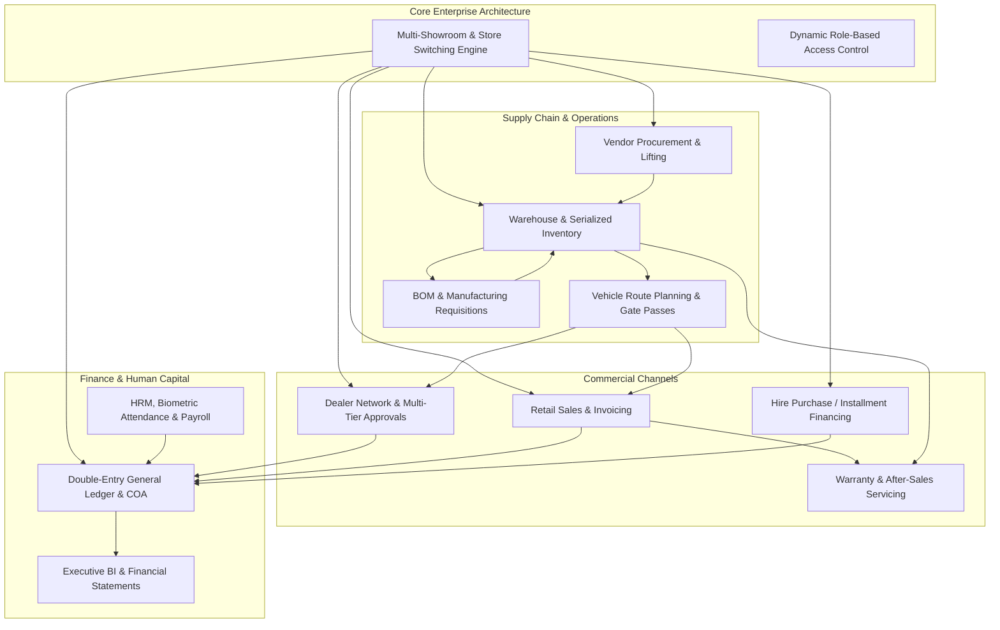

# AppPro ERP — Enterprise Sales, Inventory, Manufacturing & Financial Management System

[](https://laravel.com/)
[](https://www.php.net/)
[](https://www.mysql.com/)
[](https://laravel.com)
[](LICENSE)

---

## 📌 Executive Summary

**AppPro ERP** (`Sales_Invent`) is an end-to-end, multi-branch Enterprise Resource Planning platform tailored for retail chains, distributors, consumer electronics & home appliance dealers, light manufacturers, and hire-purchase/installment businesses.

Built on **Laravel**, it bridges front-counter Point-of-Sale (POS), multi-tiered B2B distribution networks, credit/installment financing (EMI), shop-floor production planning, after-sales warranty servicing, human capital management (HRM/Payroll), and full double-entry general ledger accounting within a unified multi-showroom architecture.



---

## 🌟 Key Architectural Pillars

| Pillar | Capabilities |
| :--- | :--- |
| **Multi-Showroom / Multi-Store Isolation** | Dynamic branch context switcher (`$this->showroomId`) stored in session; completely isolates stock balances, daily ledgers, sales numbers, cash drawers, and reports per location while maintaining central corporate consolidation. |
| **Dual Commercial Engine (B2B + B2C)** | Native support for both enterprise B2B dealer networks (orders, multi-tier approvals, delivery chalans, commissions) and B2C retail POS (counter sales, customer KYC, receipt printing). |
| **Hire Purchase & Installment Financing** | Complete credit agreement engine with guarantor tracking, automated amortization/installment schedule generators, collection logging, automatic reschedule engines, and early account settlement calculation. |
| **Serialized Asset & Warranty Tracking** | Item-level serial number logging throughout procurement (Lifting), dispatch (Product Issue), and consumer sale; facilitates automated warranty lookup, RMA diagnostics, and service delivery. |
| **Standard Double-Entry Accounting** | 4-tier Chart of Accounts (COA) with visual hierarchical tree, Debit/Credit/Journal/Opening Balance vouchers, Maker-Checker voucher approval workflows, Bank Reconciliation, and real-time Balance Sheet & P&L statements. |
| **Integrated Human Resources & Payroll** | Hierarchy management (Region/Area/Territory), team sales target setting, manual/biometric daily attendance logs, multi-stage leave approvals, salary configurations, staff loan EMIs, and monthly payroll processing. |

---

## 📂 Core Functional Modules & Feature Breakdown

### 1. 🏢 Multi-Showroom & Store Management
* **Multi-Branch Setup:** Configure headquarters, regional branch showrooms, project showrooms, and central/regional warehouses (`tbl_showroom`, `tbl_stores`, `tbl_showroom_projects`).
* **Active Branch Context:** Switch between branch contexts upon login with strict session-scoped data filters.
* **Inter-Store & Inter-Showroom Transfer:**
  * Transfer requisition initiation (`TransferProductController`).
  * Serialized product selection with transit tracking.
  * Destination verification and 2-step approval on arrival (`ReceiveProductController`).
  * Transfer issue and transfer receive reports with printable delivery notes.

---

### 2. 📦 Product Catalog, Categorization & Barcodes
* **Hierarchical Classification:** Unlimited categories and subcategories (`CategorySetupController`).
* **Multi-Price Structure:** Independent price points per item:
  * Vendor Cost / Purchase Price
  * Cash Retail Price
  * Maximum Retail Price (MRP)
  * Hire Purchase / Installment Price & Minimum Down Payment
* **Rich Product Metadata:** Model numbers, variant colors, product images, technical specs, reorder threshold quantities (`reorder_level_qty`), and SEO metadata.
* **Barcode Generation & Printing:** Integrated barcode generation engine using `milon/barcode` with customizable label sizes for box and product stickers (`LiftingController@printBarCode`).
* **Catalog Consolidation:** Utilities for resolving duplicate product entries and merging model identifiers across legacy records (`ProductMergeController`, `ProductModelMergeController`).

---

### 3. 🚚 Procurement, Lifting & Vendor Management
* **Supplier / Vendor Registry:** Profile tracking with contact info, opening balances, payment terms, and vendor ledger statements (`VendorSetupController`, `tbl_vendors`).
* **Inward Lifting (Goods Receipt):**
  * Record vendor shipments against unique voucher numbers (`LiftingController`).
  * Item-by-item quantity, unit cost, and individual serial number enrollment.
  * Support for variant-based attributes (model, color, specifications).
* **Lifting Return to Vendor:**
  * Vendor returns workflow with defective item logging and credit notes (`LiftingReturnController`).
* **Vendor Settlements & Statements:**
  * Corporate vendor payment vouchers (`PaymentToCompanyController`).
  * Vendor real-time statement report aggregating liftings, returns, and payments (`view_vendor_statement_report`).
  * Lifting summaries and historical purchase audits.

---

### 4. 🤝 B2B Dealer & Distribution Network
* **Dealer Onboarding & KYC:** Dealer profile management with regional territory assignment, bank guarantees, trade licenses, and digital document uploads (`DealerSetupController`, `DealerDocument`).
* **Multi-Tier Requisition Approval Flow:**
  ```
  [Dealer Requisition Submitted]
                 │
                 ▼
  [1. Suggestion / Review Stage]
  (DealerRequisitionApprovalController@suggestionIndex)
                 │
                 ▼
  [2. Departmental Requisition Approval]
  (DealerRequisitionApprovalController@update)
                 │
                 ▼
  [3. Final Executive Approval]
  (DealerFinalApprovalController@update)
                 │
                 ▼
  [4. Product Issue & Dispatch]
  (ProductIssueController@save)
  ```
* **Product Dispatch & Invoicing:**
  * Multi-item order fulfillment with serial number assignment.
  * Automatic dual-document generation: **Delivery Chalan** & **Commercial Tax Invoice**.
  * Gate Pass authorization for warehouse security checkpoint exit (`GatePassController`).
  * Vehicle route planning and manifest generation (`RootPlanController`).
* **Dealer Financials & Collections:**
  * Flexible payment collections with money receipts (`DealerCollectionController`).
  * Commission structure configuration and tier calculation (`DealerCommissionController`, `DealerCommissionStatementController`).
  * Dealer territory migration and account merging (`DealerTransferController`, `DealerMergeController`).
* **Dealer BI Analytics:**
  * Dealer Outstanding Ratio analysis (`DealerOutstandingRatioController`).
  * Dealer Realization percentage tracking (`DealerRealizationController`).
  * Dealer-wise Sales & Product Contribution matrices (`DealerSalesContributionController`, `DealerWiseProductContributionController`).

---

### 5. 🛍️ Retail Sales & Point-of-Sale (B2C)
* **Customer KYC & Registration:**
  * Customer profile, NID, phone numbers, permanent & present addresses (`CustomerRegistrationSetupController`).
  * Guarantor KYC: name, contact, workplace, and signed security verifications (`CustomerGuarantor`).
* **Retail Invoicing:**
  * Cash sales, debit-balance invoice sales, and credit customer sales (`RetailSalesController`).
  * Automated itemized invoice and chalan printing (`InvoiceSetupController`).
* **Sales Returns & Replacements:**
  * Customer product returns with refund/credit balance adjustments (`RetailSalesReturnController`).
  * Same-invoice or cross-model Product Exchanges (`ProductExchangeController`).
* **Promotional Campaigns & Offers:**
  * Promotional discount schemes, seasonal campaigns, and special price overrides (`OfferController`, `CampaignCommissionSetupController`).
* **Bulk Retail Operations:**
  * Spreadsheet import/export for bulk retail transactions and mass collections (`RetailBulkSaleControler`, `RetailBulkCollectionController`).

---

### 6. 📅 Hire Purchase & Installment Financing (Credit Sales)
Designed specifically for consumer durables and appliances sold on flexible installment schemes:
* **Amortization Setup:**
  * Deposit/down-payment tracking, interest rates, number of installments, and installment frequency (`InstallmentScheduleController`).
  * Automated schedule generation specifying due dates and monthly amounts.
* **Installment Collection:**
  * Front-counter or field-agent collection logging with immediate printed money receipts (`InstallmentCollectionController`).
* **Rescheduling Engine:**
  * Single-installment date/amount modification (`ReScheduleInstallmentController@UpDateSingle`).
  * Automatic rescheduling recalculator that cascades remaining balances across remaining durations.
* **Delinquency Monitoring:**
  * Overdue schedules report and aging alerts (`OverDueScheduleController`, `OverDueMonthReportController`).
  * Unpaid customer tracking with days overdue (`UnpaidCustomerController`).
* **Settlement & Account Closure:**
  * Full premature/mature account closure workflow with late-day penalties or rebate concessions (`AccountCloseController`, `CloseAccountReportController`).
  * Customer loan classification & account auditing (`ClassifyAccountController`, `AuditAccountController`).

---

### 7. ⚙️ Manufacturing & Production
* **Recipe / Bill of Materials (BOM):** Definition of finished product assembly templates and raw material consumption (`ManufactureController`).
* **Production Requisitions:** Requisition for production batches with suggestion and dual-level approval workflows (`ProductionRequisitionController`, `ProductionRequitionApprovalContrller`).
* **Production Execution & Issues:** Material issuance against requisitions and finished goods entry (`ProductionIssueHistoryController`, `ProductionHistoryController`).
* **Production vs. Requisition Yield Analysis:** Direct variance tracking between approved requisition quantities and actual workshop yield (`ApprovalVsProductionController`).
* **Pro-Sales:** Direct dispatch and invoicing of manufactured goods with batch barcode generation (`ProSalesController`).

---

### 8. 🛠️ After-Sales Servicing & Warranty Management
* **Warranty Verification:** Instant lookup of warranty validity by serial number, customer name, or invoice date (`WarrantyController`).
* **Service Job Intake:** Receiving defective units, recording customer problem descriptions, accessories received, and visual remarks (`ServiceProductReceiveController`).
* **Job Allocation & Technician Assignment:** Assigning repair jobs to technical staff, tracking diagnostic status, and allocating required spare parts (`ServiceAllocationController`).
* **Progress Tracking:**
  * Running allocations (in-progress repairs).
  * Completed allocations with labor and spare parts costing (`completeAllocation`).
* **Service Delivery:** Returning repaired goods with Service Invoices, Chalans, and Gate Passes (`ServiceProductDeliveryController`).
* **Service Center Inventory:** Tracking dedicated spare parts stock balances and servicing profitability (`ServiceProductStockController`, `ServiceReportController`).

---

### 9. 💰 Financial Accounting & General Ledger
Comprehensive double-entry bookkeeping system compliant with standard financial accounting principles:
* **Hierarchical Chart of Accounts (COA):**
  * 4-level deep tree: Assets (1), Liabilities (2), Equity/Capital (3), Income (4), Expense (5) (`CoaSetupController`, `tbl_coa`).
  * Interactive AJAX tree visualization and ledger head creation.
* **Voucher Management:**
  * **Debit Vouchers (DV):** Cash/Bank payments (`DebitEntryController`).
  * **Credit Vouchers (CV):** Cash/Bank receipts (`CreditEntryController`).
  * **Journal Vouchers (JV):** General non-cash adjusting entries (`JournalEntryController`).
  * **Opening Balance Vouchers (OB):** Financial year roll-over and initial balances (`OpeningBalanceController`).
* **Maker-Checker Governance:** Vouchers remain in draft state until verified and approved or refused by authorized financial controllers (`VoucherApproveController`, `VoucherRefuseController`).
* **Bank Reconciliation:** Match bank statement transactions with internal book transactions and track uncleared checks (`ReconciliationEntryController`).
* **Financial Reports & Statements:**
  * **Cash Book & Bank Book:** Daily opening balance, inflows, outflows, and closing balance (`CashBookController`, `bankBookController`).
  * **General Ledger & Subsidiary Transaction Ledgers:** Filterable by head code and date range (`GeneralLedgerController`, `TransactionLedgerController`).
  * **Trial Balance:** Balanced summary of debits and credits (`TrialBalanceController`).
  * **Profit & Loss / Income Statement:** Operating revenue, COGS, operating expenses, and net profit (`IncomeStatementController`).
  * **Balance Sheet:** Statement of financial position with automated current year earnings integration (`BalanceSheetController`).
  * **Asset Depreciation:** Straight-line or diminishing value depreciation schedules for fixed assets (`DepriciationController`).
  * **Bank Loan Management:** Commercial loan tracking, schedule generation, and repayment voucher logging (`BankLoanController`, `BankLoanPaymentController`).

---

### 10. 👥 Human Resource Management (HRM) & Payroll
* **Workforce Directory:** Complete employee database with biodata, department, designation, salary structure, and photo (`EmployeeSetupController`, `StaffSetupController`).
* **Organizational Territory Mapping:** Regional mapping across Divisions, Districts, Upazilas, Areas, and Territories (`RegionSetupController`, `AreaSetupController`, `TerritorySetupController`).
* **Sales Groups & Targets:** Formation of sales squads under Team Leaders, setting monthly targets by category, and monitoring real-time achievement percentages (`GroupSetupController`, `GroupSalesTargetSetupController`, `GroupSalesTargetAchivementController`).
* **Attendance System:**
  * Manual & automated daily attendance logs (`ManualAttendanceController`).
  * Daily and monthly attendance registers with In-Time, Late-Time, Leave, and Absent breakdowns (`DailyAttendenceSheetController`, `MonthlyAttendenceSheetController`, `AttendenceSummaryReportController`).
* **Leave Management:**
  * Configurable leave categories (Casual, Sick, Annual, Maternity) and annual holiday calendar (`LeaveTypeController`, `HoliController`).
  * Multi-tier leave requests: Employee submission $\rightarrow$ Supervisor suggestion $\rightarrow$ Management final approval (`LeaveRequestController`, `LeaveRequestSuggestController`, `LeaveRequestApproveController`).
  * Historical leave log reports per employee (`EmployeeLeaveLogController`).
* **Payroll & Compensation:**
  * Base salary definition, fixed and recurring allowances/deductions (`SalarySetupController`, `AllowanceSetupController`, `EmployeeAllowanceController`).
  * Staff loan disbursement and monthly automated EMI deduction from payroll (`StaffLoanController`, `StaffLoanCollectionController`).
  * Performance-based employee commission calculation and allocation (`EmployeeCommissionController`, `EmployeeCommissionAllocationController`).
  * One-click Monthly Salary Processing with pay slip generation and disbursement history (`MonthlySalaryProcessController`, `PayrollPaymentHistoryController`).

---

### 11. 🔒 Security, Dynamic RBAC & System Settings
* **Authentication:** Guarded authentication system (`auth:admin`) with password recovery.
* **Database-Driven Dynamic RBAC:**
  * Roles management (Super Admin, Branch Manager, Accountant, Sales Officer, Store Keeper, etc.) (`UserRoleController`).
  * Granular permission checkboxes dynamically mapped to navigation menus (`tbl_user_menus`) and individual controller actions (`tbl_user_menu_actions`).
  * Middleware interception (`menuPermission`) verifying authorization before executing protected route actions.
* **White-Label System Settings:** Company name, legal registration details, tax numbers, logo, favicon, and system defaults (`SettingsController`).
* **Interactive Executive Dashboard:** Real-time KPI widgets and analytical charts powered by AJAX (`HomeController`):
  * Aggregate Dealer Count, Total Sales, Gross Collections, Total Outstanding.
  * Production metrics, Lifting volume, Vendor payments & dues.
  * Region-wise sales distribution charts, Top 12 Dealers, Monthly Cashflow trends, and Inventory balances.

---

## 🗄️ Database Architecture & Key Views

The database contains over **50 relational tables** and relies on high-performance **MySQL Views** (`query.php`) to power real-time analytics without incurring high computation overhead on large transactional datasets:

| SQL View Name | Purpose & Data Aggregation |
| :--- | :--- |
| `view_stock_valuation` | Real-time stock valuation combining Liftings, Returns, Invoices, and Product Issues. |
| `view_out_of_stock` | Aggregates product stock levels versus `reorder_level_qty` to flag low inventory. |
| `view_customer_outstanding` | Balances sales invoice totals against cumulative cash collections per customer. |
| `view_customer_statement` | Chronological unified ledger of customer sales debits and cash collection credits. |
| `view_sales_history` | Multi-table join of invoices, customers, sales reps, sales groups, and warranty data. |
| `view_dealer_statement` | Tracks dealer net ledger position across product dispatches, returns, and collections. |
| `view_dealer_sales_contribution` | Aggregates dealer sales volume and total values to determine top distributor tiers. |
| `view_account` | Double-entry voucher lookup matching Debit and Credit legs with corresponding COA titles. |
| `view_voucher_approve` | Aggregates unapproved Debit, Credit, Journal, and Opening Balance vouchers for Maker-Checker review. |
| `view_vendor_statement_report` | Reconciles vendor liftings, returns, and company payments for an accurate supplier balance. |
| `view_store_and_showroom` | Union of warehouses and showrooms to present a unified transit point registry. |
| `view_transport_record` | Logs inter-branch transfer product dispatches, serial numbers, and transit status. |

---

## 💻 Technology Stack

### Backend
* **Language:** PHP `>= 7.1.3` (compatible up to PHP 8.2 via modern runtime wrappers)
* **Framework:** [Laravel 5.5 LTS](https://laravel.com/docs/5.5)
* **ORM:** Eloquent ORM
* **PDF & Printing Engines:**
  * `barryvdh/laravel-dompdf` (DomPDF wrapper)
  * `niklasravnsborg/laravel-pdf` (mPDF wrapper for complex Asian fonts and Unicode)
  * `milon/barcode` (1D/2D Barcode generation)
* **Data Grids:** `yajra/laravel-datatables` (Server-side tabular processing)
* **Image Processing:** `intervention/image`
* **Cart/POS Buffer:** `gloudemans/shoppingcart`
* **Payment Gateway Ready:** `shipu/php-aamarpay-payment`

### Frontend & UI
* **Template Engine:** Laravel Blade
* **CSS Framework:** Bootstrap 4 with Elite Admin Dashboard UI
* **Icons:** FontAwesome 4.7 & Themify Icons
* **Client Scripting:** jQuery 3.x, DataTables, Select2, SweetAlert
* **Charting:** Morris.js, Highcharts, Google Charts

---

## 📁 Repository Directory Structure

```plaintext
appproerp.com/public_html/
├── app/
│   ├── Http/
│   │   ├── Controllers/
│   │   │   ├── Admin/             # 180+ Enterprise business logic controllers
│   │   │   ├── Auth/              # Multi-guard authentication controllers
│   │   │   ├── Controller.php     # Base controller with showroom context initialization
│   │   │   ├── HomeController.php # Executive dashboard and AJAX analytics feeds
│   │   │   └── DBScriptController.php # Migration and data maintenance utilities
│   │   └── Middleware/            # Menu permission, authentication, and branch guards
│   ├── HelperClass.php            # Global financial, date, and formatting utilities
│   ├── Link.php                   # Granular action and permission authorization helper
│   ├── Admin.php                  # System administrator and user models
│   ├── CoaSetup.php               # Chart of Accounts model
│   ├── RetailSale.php             # POS and retail sales models
│   ├── Installment.php            # Hire purchase amortization models
│   ├── Product.php                # Inventory and catalog models
│   └── ... (140+ Eloquent Models)
├── bootstrap/                     # Application bootstrapping and autoloading
├── config/                        # Laravel core & package configuration files
├── database/
│   ├── db/
│   │   └── localhost.sql          # Baseline production database schema and seed data
│   ├── migrations/                # Database schema migrations
│   └── seeds/                     # Database seeders
├── public/                        # Web root (CSS, JS, Elite Admin assets, uploaded images)
├── resources/
│   └── views/
│       ├── admin/                 # 188+ Blade template folders covering all business modules
│       ├── layouts/               # Master, report, barcode, and print layout blades
│       └── partials/              # Navigation bar, dynamic database-driven sidebar, and footers
├── routes/
│   ├── web.php                    # 1,200+ authenticated enterprise web routes
│   └── api.php                    # API routes
├── coa_data.php                   # Default Chart of Accounts SQL initialization dataset
├── query.php                      # Core MySQL View definitions powering the ERP analytics
├── composer.json                  # PHP package dependencies
└── server.php                     # Local development router
```

---

## 🚀 Installation & Deployment Guide

### Prerequisites
* **PHP:** `7.1.3` to `8.0+` (Extensions required: `OpenSSL`, `PDO`, `Mbstring`, `Tokenizer`, `XML`, `Ctype`, `JSON`, `GD` or `Imagick`)
* **Web Server:** Apache (with `mod_rewrite`) or Nginx
* **Database:** MySQL 5.7+ or MariaDB 10.3+
* **Dependency Manager:** [Composer](https://getcomposer.org/)

---

### Step-by-Step Setup

#### 1. Clone or Extract the Project
```bash
git clone https://github.com/imranbru99/multi-showroom-sales-inventory-erp.git
cd multi-showroom-sales-inventory-erp
```

#### 2. Install Composer Dependencies
Run composer installation with optimized autoloader:
```bash
composer install --optimize-autoloader --no-dev
```

#### 3. Configure the Environment (`.env`)
Copy `.env.example` to create your local `.env` file and configure database credentials:
```bash
cp .env.example .env
```
Update your `.env` configuration:
```ini
APP_NAME=Sales_Invent
APP_ENV=production
APP_KEY=base64:pIYsdLfMS8bbEUkCCgjM/3IQ+bDK+AG7KmaSQxiwmEo=
APP_DEBUG=false
APP_URL=http://your-domain.com

DB_CONNECTION=mysql
DB_HOST=127.0.0.1
DB_PORT=3306
DB_DATABASE=appproe1_erp
DB_USERNAME=your_db_username
DB_PASSWORD=your_db_password

CACHE_DRIVER=file
SESSION_DRIVER=file
QUEUE_DRIVER=sync
```

If setting up a fresh instance, generate an application key:
```bash
php artisan key:generate
```

#### 4. Import the Database & Database Views
1. Import the primary database schema and baseline records from `database/db/localhost.sql`:
   ```bash
   mysql -u your_db_username -p appproe1_erp < database/db/localhost.sql
   ```
2. Ensure the Chart of Accounts dataset is present (if not loaded by the SQL dump, execute `coa_data.php`).
3. **Execute SQL Views (`query.php`):**
   AppPro ERP relies on the views defined in `query.php`. Ensure these views are generated inside your MySQL database. You can execute them via your database client (phpMyAdmin, MySQL Workbench, or CLI).

#### 5. Set Directory Permissions
Ensure that the web server has write permissions to the `storage/` and `bootstrap/cache/` directories:
* **Linux / Apache / Nginx:**
  ```bash
  chmod -R 775 storage bootstrap/cache
  chown -R www-data:www-data storage bootstrap/cache
  ```
* **Windows / IIS / XAMPP:** Ensure the user running PHP has Full Control permissions on `storage` and `bootstrap/cache`.

#### 6. Clear & Cache Configurations
Run the Artisan optimization commands to ensure smooth execution:
```bash
php artisan config:clear
php artisan cache:clear
php artisan view:clear
php artisan route:clear
```
*(You can also access the `/clear` route in your browser as an administrator to run these commands remotely).*

#### 7. Launch Local Server
For local development and testing:
```bash
php artisan serve --port=8000
```
Then navigate to: `http://localhost:8000`

---

## 🔐 User Authentication & Roles

* **Default Login URL:** `/admin/login` or `/login`
* **Multi-Showroom Gateway:** Upon login, select the active Showroom/Branch from the showroom picker dialog.
* **Role Permissions Management:** Navigate to **User Management** $\rightarrow$ **User Roles** to create roles and assign menu links and action buttons dynamically.

---

## 📊 Standard Business Workflows

### 1. Inventory Procurement & Tagging
1. Add vendor details under **Vendor Setup**.
2. Navigate to **Lifting** $\rightarrow$ **Add Lifting**.
3. Select Vendor, Showroom/Store, enter invoice voucher details, add items, specify purchase prices, and input or scan individual serial numbers.
4. Click **Print Barcode** to generate serialized labels for immediate physical application on products.
5. Inward inventory is automatically reflected in **Stock Status** and **Stock Valuation**.

### 2. B2B Dealer Requisition to Dispatch
1. **Requisition:** Dealer or Sales Rep files a requisition via **Dealer Requisition**.
2. **Review:** Operations review suggestions under **Dealer Requisition Suggestion**.
3. **Approval:** Department managers approve requested counts in **Dealer Requisition Approval**, followed by final authorization in **Dealer Final Approval**.
4. **Fulfillment:** Warehouse issues items via **Product Issue**, assigning specific serial numbers.
5. **Dispatch:** Generate and print the **Delivery Chalan** and **Commercial Invoice**. Create a **Gate Pass** for vehicle security check.
6. **Delivery Routing:** Add the shipment to the **Route Plan (Root Plan)** for vehicle route scheduling.

### 3. Retail Hire Purchase (Installment) Sale
1. Register customer under **Customer Registration Setup**, capturing photograph, NID, address, and Guarantor info.
2. Under **Retail Sales**, create a new sale with purchase type `Installment`.
3. Set Cash/MRP price, initial deposit, number of installments, and interest calculation.
4. An **Installment Schedule** is generated automatically with monthly payment milestone dates.
5. Monthly installments are collected via **Installment Collection**, issuing a printed payment receipt.
6. If the customer encounters payment issues, utilize **Reschedule Installment** to re-amortize the remaining balance.
7. Upon completing payments, trigger **Account Close** to archive the ledger and issue a clearance certificate.

### 4. Financial Year-End & Voucher Auditing
1. Operational transactions (Cash collections, vendor payments, salary vouchers) create automatic draft entries or manual vouchers via **Debit Entry**, **Credit Entry**, or **Journal Entry**.
2. The Chief Accountant audits vouchers in **Voucher Approve**; approved entries immediately post to the **General Ledger**.
3. Review month-end reconciliations using **Bank Reconciliation**.
4. Generate the **Trial Balance**, **Profit & Loss Statement (Income Statement)**, and **Balance Sheet** with a single click.

---

## 🛠️ Maintenance & Troubleshooting

* **Clearing Application Caches:**
  Visit `http://your-domain.com/clear` or run:
  ```bash
  php artisan cache:clear && php artisan config:clear && php artisan view:clear && php artisan route:clear
  ```
* **Database Views Not Found:**
  If a report throws an SQL table/view not found error, open `query.php`, copy the corresponding `CREATE OR REPLACE VIEW ...` statement, and execute it directly in MySQL.
* **Storage Symlink:**
  To ensure uploaded product images, dealer KYC documents, and employee pictures are publicly accessible:
  ```bash
  php artisan storage:link
  ```

---

## 📄 License & Intellectual Property

This project is licensed under the MIT License — see the [LICENSE](LICENSE) file for details.

---

## 🤝 Let's Build Something Exceptional

I'm actively open to:
**Remote Senior Full-Stack Roles · Freelance Contracts · Technical Partnerships · Long-Term Collaborations**  
in **Laravel · WordPress · React/Next.js · AI-powered Platforms · Security Audits · SaaS Architecture**

* 📍 **Timezone:** UTC+6 (Dhaka/Rangpur) — flexible overlap for US, EU & Asia
* ⚡ **Available:** Immediately · Production-first · Fast delivery · Transparent communication

| Platform | Link |
| :--- | :--- |
| 🌐 **Portfolio** | [imrandev.bd](https://imrandev.bd/) |
| 💼 **LinkedIn** | [linkedin.com/in/imranbru99](https://www.linkedin.com/in/imranbru99/) |
| 🐙 **GitHub** | [github.com/imranbru99](https://github.com/imranbru99) |
| 🐦 **X / Twitter** | [@imrandev_bd](https://x.com/imrandev_bd) |
| 📺 **YouTube** | [@ImranDevBD](https://www.youtube.com/@ImranDevBD) |
| 📸 **Instagram** | [@imranbru99](https://www.instagram.com/imranbru99/) |
| 📘 **Facebook** | [ExpertImranDev](https://www.facebook.com/ExpertImranDev/) |
| 🎵 **TikTok** | [@imrandev_bd](https://www.tiktok.com/@imrandev_bd) |
| 🧵 **Threads** | [@imranbru99](https://www.threads.com/@imranbru99) |
| 📌 **Pinterest** | [@imrandev_bd](https://www.pinterest.com/imrandev_bd/) |
| 💬 **WhatsApp** | [+880 1576-918420](http://wa.me/+8801576918420) |
| 📧 **Email** | [me@imrandev.bd](mailto:me@imrandev.bd) |
| 🔗 **All Links** | [linktr.ee/ExpertImranDev](https://linktr.ee/ExpertImranDev) |

> *"Security isn't an add-on — it's the foundation. Scale, speed, and trust drive every line of code I write."*  
> — **Imran Ahmed**
